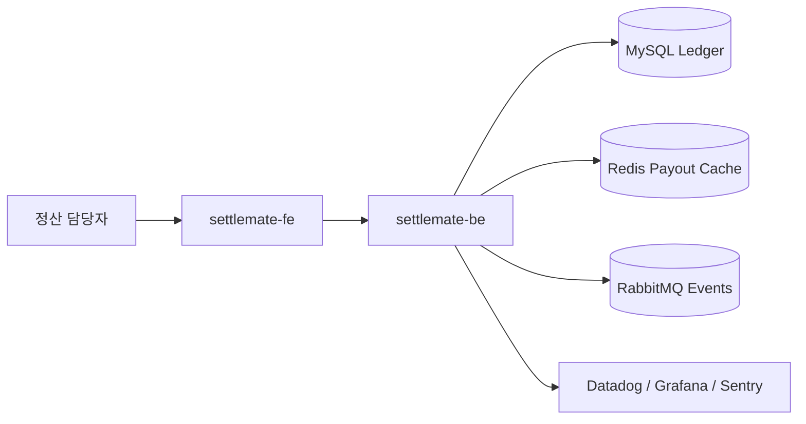

# SettleMate Workspace

[](https://github.com/settlemate-labs/settlemate-workspace/actions/workflows/ci.yml)

가맹점 정산, 환불 이상치, 지급 보류를 다루는 정산 운영 워크스페이스입니다.

## 해결하는 문제

정산 시스템은 정상 지급보다 예외 처리가 더 중요합니다. SettleMate는 환불 급증, 지급 보류, 정산 가능 금액을 분리해서 가맹점 정산 리스크를 빠르게 판단합니다.

## 레포 구조

| 구분 | 레포 | 설명 |
| --- | --- | --- |
| Workspace | [`settlemate-workspace`](https://github.com/cyjoon68/settlemate-workspace) | Git submodule 루트 |
| Frontend | [`settlemate-fe`](https://github.com/settlemate-labs/settlemate-fe) | Expo 기반 정산 대시보드 |
| Backend | [`settlemate-be`](https://github.com/settlemate-labs/settlemate-be) | Kotlin/Spring 정산 API |

## 주요 기능

- 환불 비율 기반 정산 리스크 판단
- 이상 환불은 지급 보류 처리
- 정산 ledger, payout cache, reconcile event 흐름 분리

## 아키텍처



## 기술 스택

- Frontend: Expo Router, React Native, `ky`, `react-native-unistyles`
- Backend: Kotlin, Spring Boot, REST
- Infra baseline: MySQL, Redis, RabbitMQ, GitHub Actions, ArgoCD
- Observability: Datadog, Grafana, Sentry

## 실행

```bash
git submodule update --init --recursive
cd settlemate-be && gradle test
cd ../settlemate-fe && npm install && npm test
```

## 운영 기준

- 기본 브랜치: `develop`
- 배포 기준: CI 통과 후 ArgoCD 동기화
- 관측 기준: payout hold count, refund spike rate, settlement latency

## 다음 개선

- 가맹점별 환불 기준 동적화
- 지급 보류 승인 워크플로우
- 정산 ledger audit trail 강화
